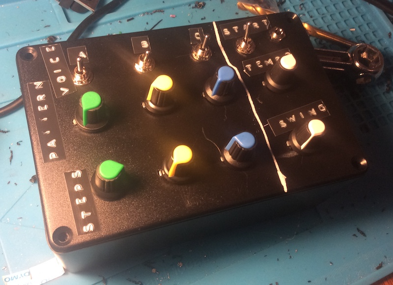
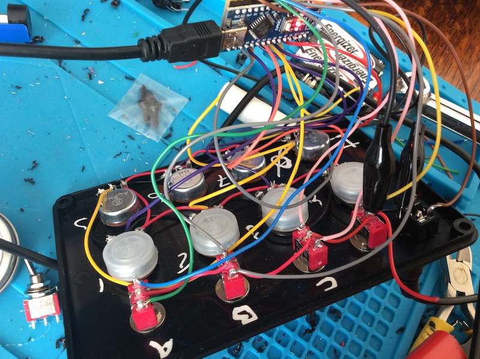

DIY Hackable Arduino Drum Machine
==

Overview
--

This project is an Arduino DIY drum machine, based on the Mozzi open source library, which uses 8-bit samples. It uses 3 channels, each with 3 selectable voices.  Each voice has a pattern selector to choose the beat pattern, and a sequence length.

So, for example, you could have channel A playing a pattern of 16 steps, with channel B playing 7 steps. This way, you can get polymetric rhythms.

Hardware: Building a DIY Arduino Drum Machine
--

You can build it any way you like using whatever case you want! I'll show you how I did mine.

I'll assume you're using an Arduino Nano - you do need at least 8 Analog inputs for the full build

> _(you could modify the software to hard-code tempo and swing if you're using an Uno)_

Here is a Bill of materials (BOM) for the components as I've used them:

Pin | Component          | Purpose
--- |--------------------| --- 
Analog 0 | B10k pot | Swing amount
Analog 1 | B10k pot | Channel A pattern
Analog 2 | B10k pot | Channel B pattern
Analog 3 | B10k pot | Channel C pattern
Analog 4 | B10k pot | Tempo
Analog 5 | B10k pot | Channel A sequence length (1-16 steps)
Analog 6 | B10k pot | Channel B sequence length (1-16 steps)
Analog 7 | B10k pot | Channel C sequence length (1-16 steps)
Digital 2 | 2 position switch  | Starts and stops the drum machine
Digital 3 and Digital 4 | 3 position switch  | Select voice A
Digital 5 and Digital 6 | 3 position switch  | Select voice B
Digital 7 and Digital 8 | 3 position switch  | Select voice C
Digital 9 | Mono jack socket | Audio out 

Here's an example of how I've built mine, excuse the poor photos, I don't have a good camera:

Developing software for the DIY Arduino Drum Machine
==

You'll need:

1. [Arduino IDE](https://www.arduino.cc/en/software/)
2. [Mozzi library](https://sensorium.github.io/Mozzi/)
3. [FFMPeg](https://ffmpeg.org/) for converting files on the CLI
   a. There are other ways to convert the files

Loading a sample into the drum machine
--

You can load whatever samples you like into this box!

Possible modifications
==

This machine is totally hackable! You could:

1. Add trigger outputs for each channel
2. Add LEDs for each trigger notification