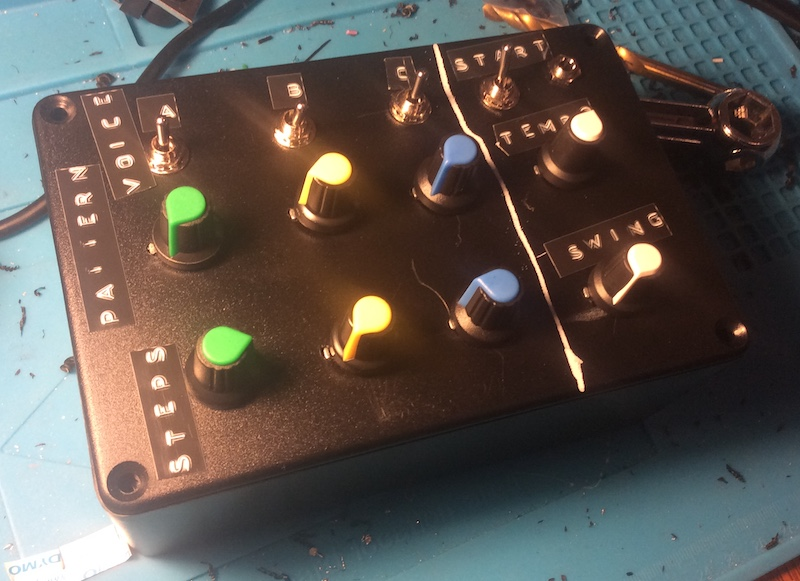
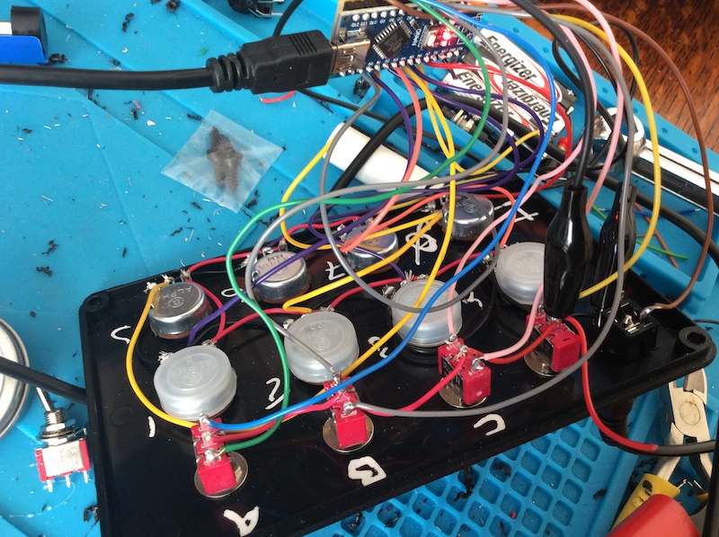
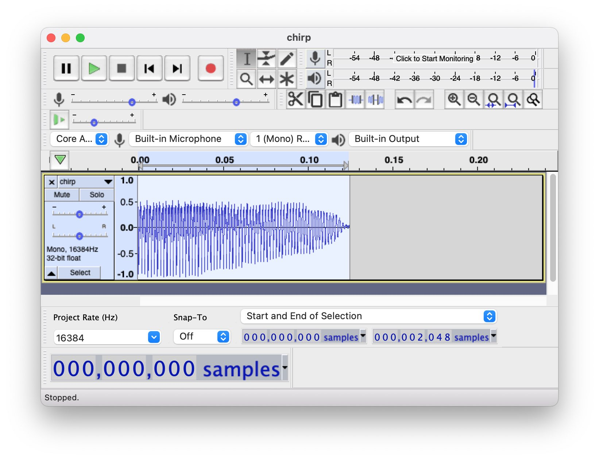
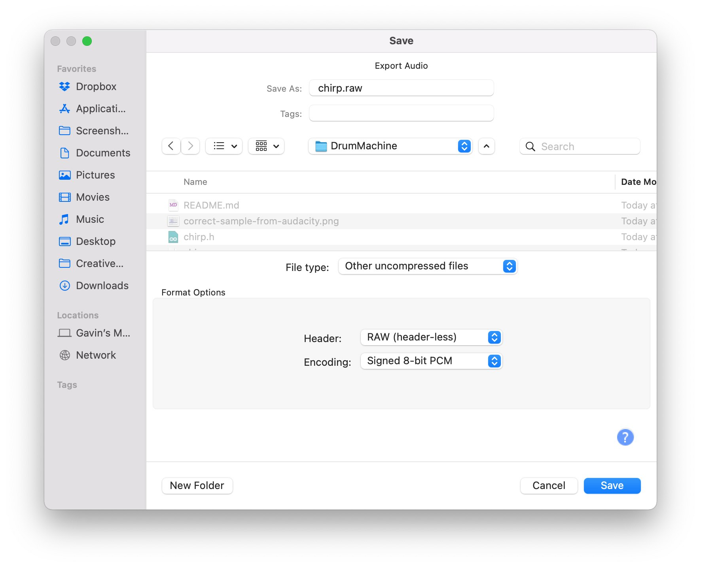

DIY Hackable Arduino Drum Machine
==

See it in action on Youtube! https://youtu.be/4u4Px2gMwGw

Overview
--

This project is an Arduino DIY drum machine, based on the Mozzi open source library, which uses 8-bit samples. It uses 3 channels, each with 3 selectable voices.  Each voice has a pattern selector to choose sequence length and number of beats. This uses Euclidean maths, a bit like a simple version of the Euclidean Circles module.

So, for example, you could have channel A playing a pattern of 16 steps, with channel B playing 7 steps. This way, you can get polymetric rhythms.



It comes loaded with samples taken from a Yamaha DD-5 digital drum machine, but you can load anything you like!

Hardware: Building a DIY Arduino Drum Machine
--

You can build it any way you like using whatever case you want! I'll show you how I did mine.

I'll assume you're using an Arduino Nano - you do need at least 8 Analog inputs for the full build

> _(you could modify the software to hard-code tempo and swing if you're using an Uno, to free up two analog inputs)_

Here is a Bill of materials (BOM) for the components as I've used them:

Pin | Component         | Purpose
--- |-------------------| --- 
Analog 0 | B10k pot | Swing amount
Analog 1 | B10k pot | Channel A beat density
Analog 2 | B10k pot | Channel B beat density
Analog 3 | B10k pot | Channel C beat density
Analog 4 | B10k pot | Tempo
Analog 5 | B10k pot | Channel A sequence length (1-16 steps)
Analog 6 | B10k pot | Channel B sequence length (1-16 steps)
Analog 7 | B10k pot | Channel C sequence length (1-16 steps)
Digital 2 | 2 position switch | Starts and stops the drum machine
Digital 3 and Digital 4 | 3 position switch | Select voice C
Digital 5 and Digital 6 | 3 position switch | Select voice B
Digital 7 and Digital 8 | 3 position switch | Select voice A
Digital 9 | Mono jack socket | Audio out 

The beat density is a proportion of the sequence length. So, if sequence length is 8, beat density will be from 0-8 beats. Beats are spaced as evenly as possible in the sequence. Experiment with different settings to create polymetric rhythms!

Here's an example of how I've built mine, excuse the poor photos, I don't have a good camera:



I drilled hole into a plastic case I bought from [Bitsbox](https://www.bitsbox.co.uk/).

Note that the switches are all in **pullup mode**, so, although I used a red wire, they're going to ground. In this image, I've also croc clipped the negative rail from the jack to the rightmost switch. It's a work in progress shot!

Developing software for the DIY Arduino Drum Machine
==

You'll need:

1. [Arduino IDE](https://www.arduino.cc/en/software/)
2. [Mozzi library](https://sensorium.github.io/Mozzi/)

If you want to load your own samples, you'll additionally need: 

1. [FFMPeg](https://ffmpeg.org/) for converting WAV files to RAW on the CLI. _There are other ways to convert the files, but FFMpeg is what I use_
2. [Python](https://www.python.org/) for running char2mozzi.py from the [Mozzi library scripts](https://github.com/sensorium/Mozzi/tree/master/extras/python). _Alternatively, Audacity can output raw audio files_

Loading a sample into the drum machine
--

You can load whatever samples you like into this box!

Any sample for conversion must be:
1. In headerless unsigned 8 bit raw format
2. Mono
3. Sample rate of 16384
4. Precisely 2048 samples long _(Audacity, for example, can be configured to show sample count for selections)_

From Audacity, it would look like this:



Export to "Other uncompressed files" like:



If you have a WAV, you can convert to RAW with ffmpeg, something like:

```bash
# Convert a WAV to a signed headerless 8 bit raw file (or output raw from your audio editor)
# let's convert a file called chirp.wav
FILE=chirp

ffmpeg -y -i ${FILE}.wav -f s8 -acodec pcm_s8 ${FILE}.raw
```

Now we can convert that to an 8 bit wavetable containing 2048 samples that the drum machine can use:

```bash
# Use char2mozzi.py to convert to a wavetable of the right length (2048)
# to a C header file that Mozzi can consue
python ../Mozzi/extras/python/char2mozzi.py ${FILE}.raw ${FILE}.h ${FILE} 16384
```

TODO list
==

I'm working on:

1. Adding Swing

Possible modifications
==

This machine is totally hackable! You could:

1. Add trigger outputs for each channel
2. Add LEDs for each trigger notification
3. Vary velocities
4. Pitch control of the voices (or a global pitch control!)
5. Voice randomisation

